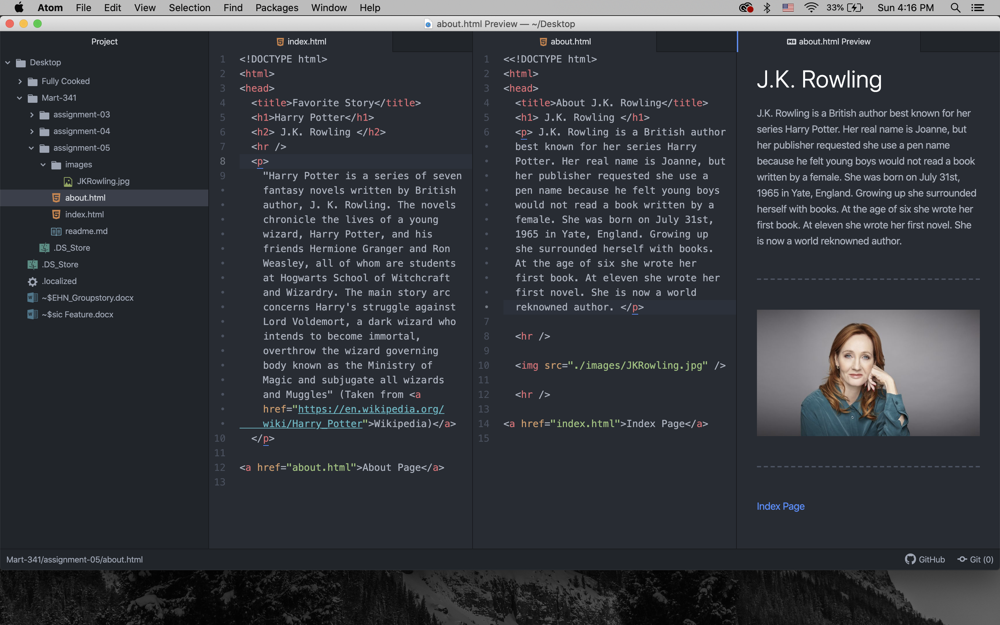

I looked at The New York Times website from February 18th, 1999. It honestly didn't look too different from the pages structure today. Their page directories were located on the left hand side of the page rather than a long the top underneath the title. They didn't have videos qued up on the front page then. It looked closer to the actual format of a newspaper.

I had a difficult time trying to figure out how to link my about.html and index.html to each other. I didn't realize it was the same syntax that you use to link pages from the web, but once I finally figure it out. The rest went rather smoothly.

