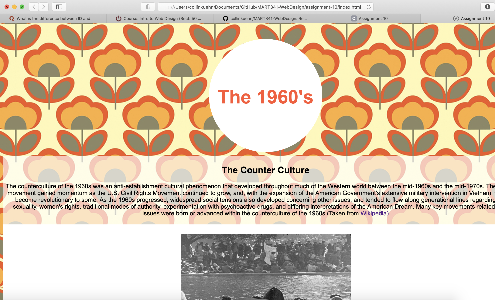

1. Describe the difference between the universal, element, class, and id selector types. When might you choose one over the other to style content?
- A Universal selector applies to every element on a page. The element selector is used to select all of one specific element. ID applies to a single element, and a class can be applied to more than one element that serves the same function.
2. Briefly discuss your color palette, including the 3 colors you chose. List their color names, RGB values, or hex codes.
- I used a patterned background, so I didn't use any RGB values or hex codes for the back ground. But I did for text. my links and the paragraph background. I used white, orange, and forest green. White (255,255,255), Black (0,0,0), Orange #FF5733, Forest Green #228B22.
3. Free Response: Please discuss any challenges you had this week and how you overcame them.
- I really struggled with adding a background in CSS and having it appear in my html. It took me quite awhile to find the full root link to the image I wanted to add. I also struggled at first with getting my headings, paragraphs and images to move cohesively down the page. At first everything literally just stacked and layered on top of each other and you couldn't read anything. I eventually just wiped the whole css and html file and started from scratch and it seemed to work.

- ok, update: for some reason my page doesn't appear to have the background or style I thought I coded or that appears in the html when I open it on github. 
Here i've included a screen shot of what it looks like in html preview. I don't know why it won't load that way with my live link.
